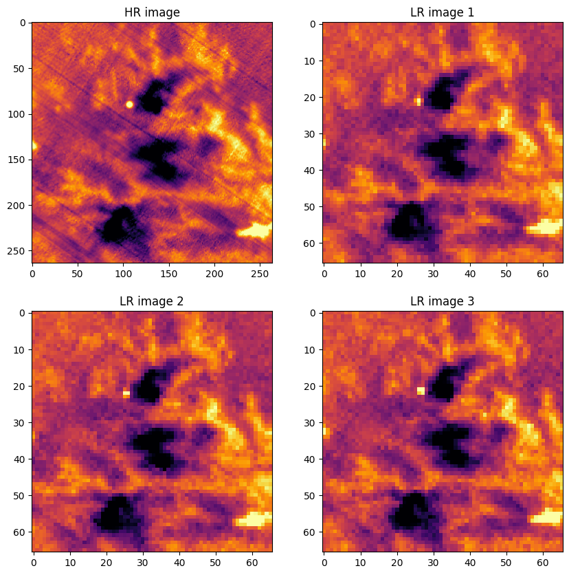

# Multi-image super-resolution for remote sensing

This project is a PyTorch implementation of [https://arxiv.org/abs/2007.03107](https://arxiv.org/abs/2007.03107), Additionally, a set of pre-processing tools is created to generate a multi-image Low-Resolution data from High-Resolution images.

## Table of Contents

- [Installation](#installation)
- [Usage](#usage)
- [Contributing](#contributing)
- [License](#license)

## Installation

```sh
pip install -r requirements.txt
```


## Usage

- First, you need datasets! You can Get it from [NASA APPEARS](https://appeears.earthdatacloud.nasa.gov/) or use this [client](https://github.com/patriciomassaro/nasa_appears_client) . Remember to keep a split for validation.
    -  Dataset must be tiffs files.
- Once you have the datasets, complete the path in [Train](src/training/train.py)
- Check the configuration file to define the parameters of the degradation model
- Run!


## How does the dataset work?

> **Objective:** The objective is to create $N$ Low-Resolution images from one High-Resolution image. Then, the LR will be the input of the super-resolution neural network that will try to regenerate the HR image.

The dataset then:

- Takes an HR input
- Makes N pixel shifts
- Degrade the image using a[Degradation Model](src/degradation_model)
- reduce the resolution by a factor of X ( The pixel shifts are now subpixel shifts)
- Yield the $N$ number of images.





